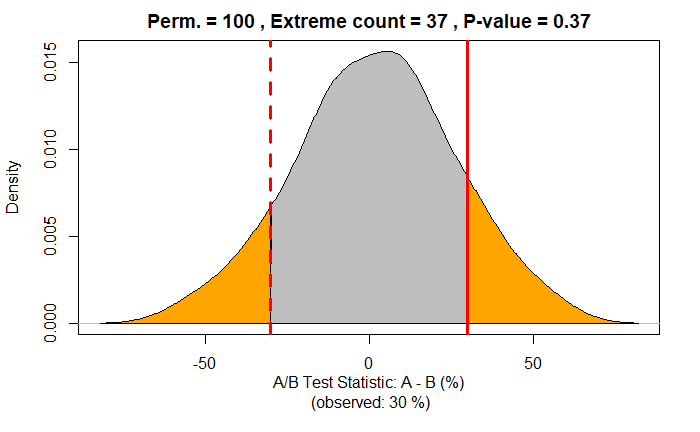
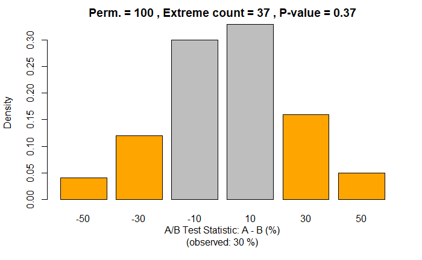
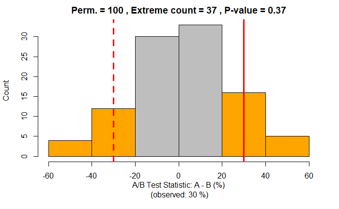
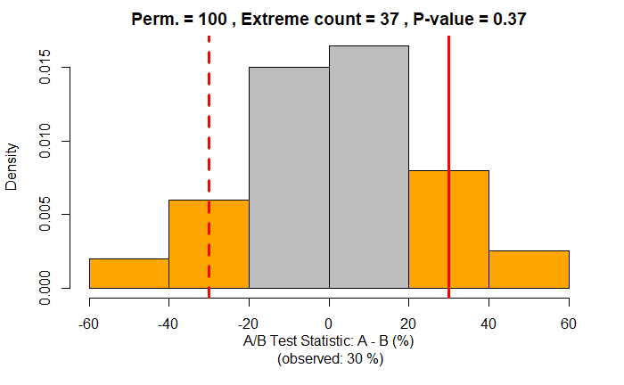

```{css, echo=FALSE}
/* custom.css */

.left-40 {
  float: left;
  width: 40%;
}
.right-60 {
  float: right;
  left-padding: 1%;
  width: 59%;
}

.left-60 {
  float: left;
  right-padding: 1%;
  width: 59%;
}
.right-40 {
  float: right;
  width: 40%;
}
```

# Outline & Main Learning Objectives

.pull-left[

**Outline**

A/B Testing

* What? & Why?
* Examples
* How?
* Hypothesis Testing (p-value)

Permutation Test

* What? & Why?
* How?

Code (in R)

* From Scratch
* General Solution, R Shiny App

Q & A

]

--

.pull-right[

**Main Learning Objectives**

Statistics

* A/B testing
* Hypothesis testing
* p-value
* Permutation test

Coding (in R)

* variables
* loops
* functions

]

---

# A/B Test - What? & Why?

--

## What is an A/B test?

--

An experiment to compare two competing **options** (A, B).

--

* **Options:** treatments (medical), designs (ad, web), products, prices, etc.

--

## Why use an A/B test?

--

To determine if the options are **different**.

--

* **Different** in a statistical sense (hypothesis testing, permutation test).

--

To determine what's the **better** option.

--

* **Better** for the question/goal at hand (e.g., customer acquisition, profit).

---

# A/B Test - Examples?

---

# A/B Test - Examples? - General

**Two soil treatments:** which one promotes ***better seed germination***?

--

**Two web headlines:** which one produces ***more clicks***?

--

**Two web ads:** which one generates ***more conversions***?

--

**Two prices:**

--

* which one yields a ***higher net profit***?

--

* which one leads to ***more new costumers***?

--

**Two therapies:** which one is ***more effective at suppressing cancer***?

--

* **Control group:** subjects exposed to ***no treatment*** or ***standard treatment***.

--

* **Treatment group:** subjects exposed to the ***new treatment***.

---

# A/B Test - Examples? - Specific

--

**Microsoft (Bing):**

--

* ***one A/B test:*** changing the way the Bing search engine displayed ad headlines

--

* led to a 12% increase in revenue;

--

* that's more than $100 million per year in the US alone

--

**Amazon:**

--

* moving credit card offers from its home page to the shopping cart page

--

* boosted profits by tens of millions of dollars annually

--

**Google & Bing:** only 10% to 20% of experiments generate positive results

--

*Reference:* [The Surprising Power of Online Experiments (Harvard Business Review, 2017)](https://hbr.org/2017/09/the-surprising-power-of-online-experiments)

---

# A/B Test - How? - Steps

--

.left-40[

(**0. Idea & Definition:** question, goal, data/subjects, options, test statistic.)

**1. Subjects:** Set of all subjects.

**2. Randomization:** Randomly assign subjects to the two groups (A, B).

**3. Results:** Expose subjects to options (A, B), measure results, and compute **test statistic**.

**4. Hypothesis testing:** determine if the observed difference is statistically significant.

* Can be done with a **permutation test**.

(**5. Action/Decision:** based on test results.)

]

.right-60[

<iframe src="figures/ab-steps-fig.html" width="100%" height="540"></iframe>

]

---

# A/B Test - How? - Didactic Example

.left-40[

.center[**A/B test observed results**]

|              | Option A | Option B |
| :----------- | -------: | -------: |
| Total        |       10 |       10 |
| No           |        3 |        6 |
| Yes          |        7 |        4 |
| Yes Rate (%) |     70 % |     40 % |

**Test statistic:** Yes Rate Difference

* (A - B) (%) = 70% - 40% = 30%

**Is this a (statistically) significant difference?**

* Is this difference just due to random change?
* Or, is it due the different options (A, B)?

Note: using small numbers for didactic purposes.

] 

.right-60[

<iframe src="figures/ab-subjects-fig.html" width="100%" height="540"></iframe>

]

---

# A/B Test - How? - Hypothesis Testing (step 4)

.pull-left[

***Is the observed difference (30%) statistically significant?***

Thanks to **randomization** any observed difference between A and B must be due to either:

* **Random chance** (in assignment of subjects); or
* A **true difference** between A and B

**Hypothesis testing:** Is random chance (Null hypothesis) a reasonable explanation for the observed difference?

* Assumes that the Null hypothesis is true
* Creates corresponding Null model (probability model)
* Tests whether the observed difference is a reasonable outcome of that Null model
  * Is the observed difference within the random variability of the Null model?

]

.pull-right[

|                            | **Two-way** test          | **One-way** test                |
| :------------------------- | :------------------------ | :------------------------------ |
| **Null hypothesis**        | $A = B$<br>(same)         | $A \leq B$<br>(A is not better) |
| **Alternative hypothesis** | $A \neq B$<br>(different) | $A > B$<br>(A is better)        |



]

---

# A/B Test - How? - Hypothesis Testing (p-value)

.pull-left[

**P-value:**

* given a random chance (probability) model that embodies the Null hypothesis, 
* the p-value is the probability of obtaining results as unusual/extreme as the observed result.

**Significance level (alpha):**

* the probability threshold of "unusualness" (e.g., 0.05);
* must be defined before the experiment.

**Decision:**

* $\text{p-value} \geq \text{alpha}$: retain the null hypothesis
  * observed difference due to random chance
* $\text{p-value} < \text{alpha}$: reject the null hypothesis
  * observed difference is real/significant

]

.pull-right[

**Type I error (false positive)**: Mistakenly concluding that an effect is real (when it is due to chance).

* Probability = $\text{alpha}$

**Type II error (false negative)**: Mistakenly concluding that an effect is due to chance (when it is real).


]

---

# Permutation Test - What? & Why?

**What? & Why?** Permutation test is a resampling procedure used for hypothesis testing.

--

**Resampling:** repeatedly sample values from the observed data to assess a statistic's random variability.

--

Two main types of resampling procedures:

--

* **Boostrap:** resampling **with** replacement, used to assess reliability of an estimate.

--

* **Permutation:** resampling **without** replacement, used for hypothesis testing.

--

**Permutation Test:** 

* A resampling procedure used for hypothesis testing

--

* Process for combining two (or more) data samples together, and randomly (or exhaustively) reallocating the observations to resamples to assess  the random variability of the test statistic

--

* A way to create the Null model, and compute the p-value

--

* Advantage: No assumptions (creates Null model from the data itself)

---

# Permutation Test - How? - Steps (diagram 1)

.pull-left[

**Step 0:** A/B test results.

**Step 1:** Put all A/B test results in a single dataset ("bag").

**Steps 2 to 5: Do one permutation:**

- **Step 2:** Shuffle the "bag".
- **Step 3:** Randomly draw (without replacement) a resample of size of group A.
- **Step 4:** Randomly draw (without replacement) a resample of size of group B (the remainder).
- **Step 5:** Record the test statistic for resamples.

**Step 6: Do many permutations:** to yield a permutation distribution of the test statistic (Null model).

**Hypothesis testing:** Use permutation results to compute the p-value as the ratio of values that are as or more extreme than the observed test statistic.

]

.pull-right[

<iframe src="figures/permutation-steps-fig.html" width="100%" height="540"></iframe>

]

---

# Permutation Test - How? - Steps (diagram 2)

.pull-left[

**Step 0:** A/B test results.

**Step 1:** Put all A/B test results in a single dataset ("bag").

**Steps 2 to 5: Do one permutation:**

- **Step 2:** Shuffle the "bag".
- **Step 3:** Randomly draw (without replacement) a resample of size of group A.
- **Step 4:** Randomly draw (without replacement) a resample of size of group B (the remainder).
- **Step 5:** Record the test statistic for resamples.

**Step 6: Do many permutations:** to yield a permutation distribution of the test statistic (Null model).

**Hypothesis testing:** Use permutation results to compute the p-value as the ratio of values that are as or more extreme than the observed test statistic.

]

.pull-right[

<iframe src="figures/permutation-subjects-fig.html" width="100%" height="540"></iframe>

]

---

# Permutation Test - How? - Hypothesis Testing

.pull-left[

A/B test observed difference: (A - B)(%) = 30%

Counts of results from **100 permutations**:

| Result | -50 | -30 | -10 |  10 |  30 |  50 |
| :----- | --: | --: | --: | --: | --: | --: |
| Counts |   4 |  12 |  30 |  33 |  16 |   5 |

**Two-way test** (Null: $A = B$, Alternative: $A \neq B$)

* Extreme values count: **37** = 4 + 12 + 16 + 5
* Extreme values ratio (p-value): **0.37** = 37 / 100

**One-way test** (Null: $A \leq B$, Alternative: $A > B$)

* Extreme (positive) values count: **21** = 16 + 5
* Extreme (positive) values ratio (p-value): **0.21** = 21 / 100

**Decision:** $\text{p-value} \geq \text{alpha } (0.05)$: retain null hypothesis

* observed difference due to random chance

]

.pull-right[


]

---

# Code - A/B Test - Didactic Example

```{r}
# Define minimum set of variables that fully define the A/B test results
t = 20     # Total number of subjects (A + B)
a = 10     # Number of subjects in group A
b = 10     # Number of subjects in group B
a_yes = 7  # "Yes" count in group A
b_yes = 4  # "Yes" count in group B

# Compute remaining A/B test results (using the variables above)
a_no = a - a_yes                # "No" count in group A
b_no = b - b_yes                # "No" count in group B
t_yes = a_yes + b_yes           # Total "Yes" count (A + B)
t_no  = a_no  + b_no            # Total "No" count (A + B)
a_yes_pc = 100 * a_yes / a      # "Yes" percentage in group A
b_yes_pc = 100 * b_yes / b      # "Yes" percentage in group B

# A/B Test Statistic: "Yes" percentage difference (A - B)
ab_yes_pc = a_yes_pc - b_yes_pc

cat('Observed Yes Rate (%):  A:', a_yes_pc, ',  B:', b_yes_pc, ',  A-B:', ab_yes_pc,
    '\nTotal counts:  Yes:', t_yes, ',  No:', t_no)
```

---

# Code - Permutation Test - One Permutation

```{r}
set.seed(0) # for reproducible results
bag1 = c(rep(1, t_yes), rep(0, t_no)) # Step 1: Combine all results in a bag (1 = Yes, 0 = No)
bag2 = sample(bag1)                   # Step 2: Shuffle the bag
a_rs = bag2[1:a]                      # Step 3: Random sample of size A
b_rs = bag2[(a+1):(a+b)]              # Step 4: Random sample of size B

# Step 5: Compute the test statistic (difference in proportion of 1s)
a_yes_pc_rs = 100 * sum(a_rs) / a
b_yes_pc_rs = 100 * sum(b_rs) / b
ab_yes_pc_rs = a_yes_pc_rs - b_yes_pc_rs

cat('(1) Bag         :', bag1, 
    '\n(2) Bag shuffled:', bag2, 
    '\n(3) A resample  :', a_rs, 
    '\n(4) B resample  :', rep(' ', a), b_rs, 
    '\n(5) Resample Yes Rate (%):  A:', a_yes_pc_rs, ',  B:', b_yes_pc_rs, ',  A-B:', ab_yes_pc_rs,
    '\n(0) Observed Yes Rate (%):  A:', a_yes_pc, ',  B:', b_yes_pc, ',  A-B:', ab_yes_pc)
```

---

# Code - Permutation Test - Many Permutations

```{r}
set.seed(1) # for reproducible results

bag = c(rep(1, t_yes), rep(0, t_no)) # Step 1: Combine all results in a bag

# Step 6: Repeat steps 2 to 5 a "large" number of times (p)
p = 100              # number of permutations
perm_res = rep(0, p) # vector for permutation results
for (i in 1:p) {
  bag = sample(bag)                               # Step 2: Shuffle the bag
  a_rs = bag[1:a]                                 # Step 3: Random sample of size A
  b_rs = bag[(a+1):(a+b)]                         # Step 4: Random sample of size B
  perm_res[i] = 100*sum(a_rs)/a - 100*sum(b_rs)/b # Step 5: Compute the test statistic
}

perm_res
```

---

# Code - Permutation Test - Hypothesis Testing

```{r}
table(perm_res)
```
```{r}
# Two-way hypothesis test (Null: A = B, Alternative: A != B)
extreme_count = sum(abs(perm_res) >= abs(ab_yes_pc))
extreme_ratio = extreme_count / p
# One-way hypothesis test (Null: A =< B, Alternative: A > B)
pos_extreme_count = sum(perm_res >= ab_yes_pc)
pos_extreme_ratio = pos_extreme_count / p
cat("Number of permutations:", p,
    "\nTwo-way: Extreme values count          :", extreme_count,
    "\nTwo-way: Extreme values ratio (p-value):", extreme_ratio,
    "\nOne-way: Extreme (positive) values count          :", pos_extreme_count,
    "\nOne-way: Extreme (positive) values ratio (p-value):", pos_extreme_ratio)
```

---

# Code - Permutation Test - Bar & Density Plots

.pull-left[

```{r}
table(perm_res)
```


]

.pull-right[




]

---

# Code - Permutation Test - Histogram & Density Plots

.pull-left[

```{r}
table(perm_res)
```


]

.pull-right[





]

---

# Code - General Solution

The previous code has been consolidated into functions in the `functions.R` script.

- The function `ab_permutation_test` can be used to perform the whole process of a Permutation Test for a given A/B Test (examples in the next slides).

```{r}
source("functions.R")
```

---

# Code - General Solution - Didactic Example

```{r, dpi=100, fig.height=4}
ab_permutation_test(a_all=10, b_all=10, a_yes=7, b_yes=4, n_p=100, verbose=TRUE, random_seed=1)
```

---

# Code - General Solution - Other Example

```{r, dpi=100, fig.height=4}
ab_permutation_test(a_all=1000, b_all=2000, a_yes=30, b_yes=100, n_p=1000, verbose=TRUE, random_seed=1)
```

---

# Code - General Solution - R Shiny App

You can use the R Shiny App defined in the `app.R` file to interactively explore A/B Testing with Permutation Test (i.e., the results of the `ab_permutation_test` function).

You can launch the app as usual in RStudio: open the `app.R` file in RStudio and press the `Run App` button.

---

# Q & A

Questions?

## Ready to learn more?

Join our Fall Bootcamps starting Sep 28.

Submit your application before the **deadline on Friday, Sep 11**.

* [Remote Live Bootcamp](https://nycdatascience.com/data-science-bootcamp/?utm_source=workshops&utm_medium=events&utm_campaign=fall_2020_bootcamps&utm_content=learn-ab-testing-with-permutations): Learn data science in real-time.

* [Full-time/Part-time Online Bootcamp](https://nycdatascience.com/online-data-science-bootcamp/?utm_source=workshops&utm_medium=events&utm_campaign=fall_2020_bootcamps&utm_content=learn-ab-testing-with-permutations): Learn data science on your own schedule.

For more information regarding our bootcamps and courses, [visit our website](https://nycdatascience.com/?utm_source=workshops&utm_medium=events&utm_campaign=fall_2020_bootcamps&utm_content=learn-ab-testing-with-permutations) or [schedule a call](https://info.nycdatascience.com/meetings/nycdsa-admissions/book-a-meeting-with-one-of-our-admissions-officers?) with our admissions team today.


